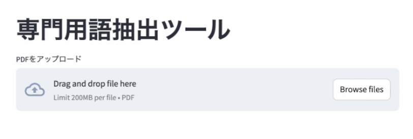
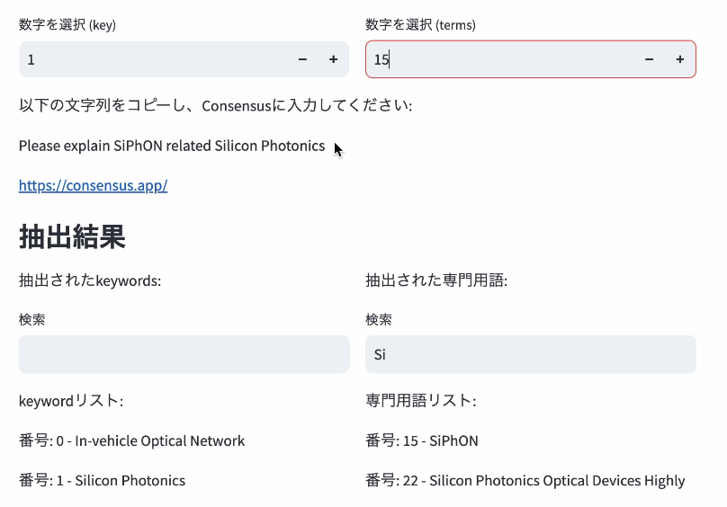

## 英語論文から、専用語（っぽい単語）リストを抽出するシステム

### セットアップ
ターミナルに以下の順番でコマンドを入力

```
python -m venv env
```

```
. env/bin/activate
```

```
pip install -r requirements.txt
```

```
python -m spacy download en_core_web_sm
```

### 実行
1. システム立ち上げ
```
streamlit run app.py
```
自動でブラウザに立ち上がらなかったら、ターミナルに記述されるLocal URLにアクセス

2. 英語論文入力


以降は、任意になります

3. 調べたい単語の選択

4. 生成された検索文を[Consensus](https://consensus.app/)に入れて説明文を生成してもらう


6. 生成された説明文を使って、[NoLang](https://no-lang.com/)に入れることで説明動画作成

## 終了
システム終了：
- control + C

環境終了：
```
deactivate
```

### 実装環境
- MacOS: 14.5
- Python: 3.10.7
- pdfminer.six: 20240706
- spacy: 3.8.4
- streamlit: 1.42.0
